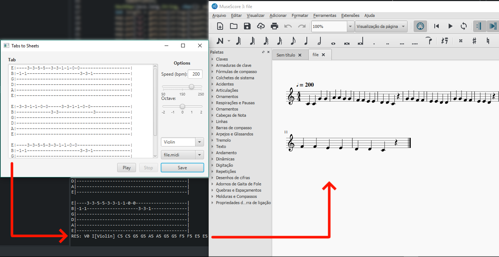

# Tabs to Sheets
This app allows you to convert any guitar riff to a MIDI file (sheet).

Note: You can find all the compatible instruments at [this guide](http://www.jfugue.org/4/jfbmrkklprpp/TheCompleteGuideToJFugue-v1.pdf) on page 32 (Fig. 2.13).
